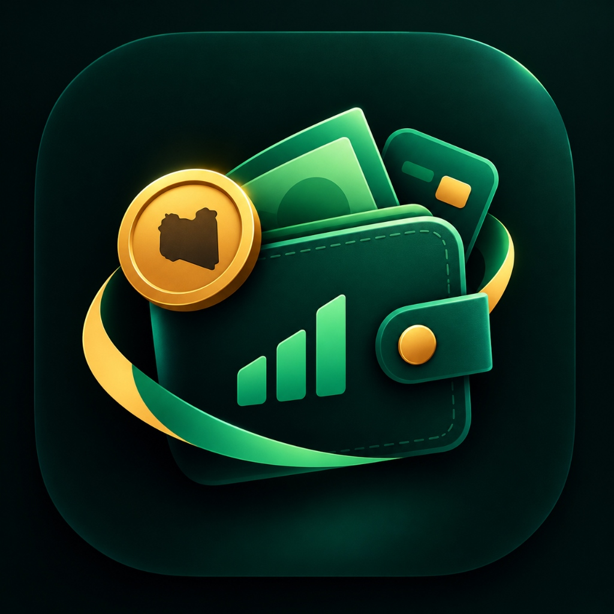

<div align="center">

# تطبيق ومنظومة مصروفي | Masroufi



### المنظومة المالية الذكية لتتبع المصاريف وقراءة الرسائل المصرفية الليبية آلياً
**Smart Personal Finance & Automated Libyan Banking SMS Parsing Platform**

<br/>

[](https://flutter.dev)
[](https://dart.dev)
[](https://laravel.com)
[](https://php.net)
[](https://mysql.com)
[](https://android.com)

</div>

---

## 📌 نبذة عن المشروع (Project Overview)

منظومة وتطبيق **مصروفي (Masroufi)** هي منصة مالية ذكية وشاملة مصممة لإدارة وتتبع المصاريف اليومية والشخصية بدقة وكفاءة عالية، مع التركيز على البيئة المالية والمصرفية الليبية.

يقوم التطبيق بالتقاط وتحليل الرسائل النصية المصرفية (Bank SMS) الواردة من مختلف المصارف الليبية بشكل لحظي ومحلي، وتحويلها تلقائياً إلى حركات مالية مصنفة (سحب، إيداع، مشتريات نقاط البيع POS، تحويلات سريعة)، مع إمكانية إدارة المصاريف النقدية (الكاش)، وتعيين ميزانيات دورية، وتوليد كشوفات حساب مالية تفصيلية بصيغة PDF.

يرتبط التطبيق بلوحة تحكم وباك إند مبني بواسطة **Laravel** لإدارة إعدادات النظام، ومزامنة الحسابات، وفحص التحديثات الجديدة وتوزيعها تلقائياً للمستخدمين (OTA Updates).

---

## 🏛️ هيكلية النظام والمشاريع (System Architecture)

تم تنظيم المشروع بهيكلية متناسقة وعالية المرونة تفصل بين تطبيق الموبايل والباك إند:

```
Masroufi/
│
├── masroufi_mobile/                       # تطبيق الموبايل (Flutter / Dart)
│   ├── assets/                            # الأيقونات، الصور والخطوط العربية
│   │   ├── images/logo.jpg                # شعار وهوية التطبيق
│   │   └── fonts/                         # الخطوط المعتمدة للواجهات
│   ├── lib/
│   │   ├── core/
│   │   │   ├── services/                  # الخدمات الأساسية والمحركات الذكية
│   │   │   │   ├── libyan_sms_parser.dart # خوارزمية تحليل رسائل المصارف الليبية
│   │   │   │   ├── sms_service.dart       # خدمة استماع وقراءة رسائل الـ SMS
│   │   │   │   ├── biometric_service.dart # حماية بالبصمة والوجه (Biometrics)
│   │   │   │   ├── update_service.dart    # فحص وتحميل التحديثات التلقائية
│   │   │   │   └── auth_service.dart      # خدمات التحقق والمصادقة
│   │   │   ├── state/
│   │   │   │   └── app_state.dart         # إدارة الحالة والتفاعل (State Management)
│   │   │   ├── theme/
│   │   │   │   ├── app_theme.dart         # نظام الألوان الموحد والوضع الداكن والفاتح
│   │   │   │   └── theme_controller.dart  # التحكم بالثيمات
│   │   │   └── utils/
│   │   │       └── pdf_export_service.dart# تصدير كشوفات الحساب وتقارير الـ PDF
│   │   └── features/
│   │       ├── home/                      # الشاشة الرئيسية وتلخيص الحسابات والأرصدة
│   │       ├── transactions/              # سجل وتفاصيل الحركات المصرفية والكاش
│   │       ├── analytics/                 # الرسوم البيانية الذكية ومؤشرات الإنفاق
│   │       ├── settings/                  # إدارة الحساب، التنبيهات، وقائمة المصارف
│   │       ├── onboarding/                # شاشات الترحيب والتعريف بالنظام
│   │       └── auth/                      # واجهات الدخول والتسجيل
│   └── pubspec.yaml                       # إدارة التبعيات والمكتبات للتطبيق
│
└── masroufi_backend/                      # لوحة التحكم وخوادم الـ API (Laravel 11 / PHP)
    ├── app/
    │   ├── Http/Controllers/              # نقاط نهاية الـ RESTful API
    │   └── Models/                        # نماذج البيانات (Users, Settings, AppVersions)
    ├── routes/
    │   └── api.php                        # مسارات الـ API (المصادقة، المزامنة، التحديثات)
    ├── database/
    │   └── migrations/                    # هيكل وتداول قواعد البيانات
    └── composer.json                      # حزم ومكتبات خادم لارافيل
```

---

## ✨ أبرز المزايا التقنية (Key Technical Highlights)

1. **محرك التحليل الذكي للرسائل المصرفية الليبية (Libyan Banking SMS Parsing Engine):**
   - دعم شامل ودقيق لكافة صيغ الرسائل الواردة من المصارف العاملة في ليبيا (مصرف الجمهورية، المصرف التجاري الوطني NCB، مصرف الوحدة، مصرف التجارة والتنمية BCD، مصرف الأمان، مصرف الصحاري، وغيرها).
   - استخراج لحظي للقيمة المالية، العملة، نوع الحركة (خصم، إيداع، شراء، حوالة)، اسم البطاقة أو الحساب، والرصيد التراكمي المتبقي.

2. **نظام تتبع مزدوج متكامل (Dual Tracking: Cash & Bank Accounts):**
   - إدارة كاملة للحسابات البنكية المستلمة آلياً جنباً إلى جنب مع المعاملات النقدية (الكاش) لضمان تغطية كافة منافذ الإنفاق.

3. **التحليلات والمؤشرات البيانية (Financial Insights & Analytics):**
   - رسوم بيانية تفاعلية توضح توزيع النفقات حسب الفئات (تسوق، فواتير، صحة، غذاء، مواصلات...) مع تتبع دوري لحدود الميزانية المحددة.

4. **تصدير كشوفات الحساب الرسمية (PDF Statements Export):**
   - محرك مدمج لتوليد كشوفات حساب وتقارير دورية احترافية بصيغة PDF قابلة للطباعة والمشاركة مع دعم كامل للغة العربية.

5. **نظام التحديثات التلقائية والتثبيت الداخلي (In-App OTA Updates):**
   - نظام متصل بالباك إند للتحقق الفوري من وجود إصدارات جديدة، وإشعار المستخدم مع إمكانية التنزيل والتحديث بسلاسة من داخل التطبيق.

6. **الحماية العالية والخصوصية التامة (Biometric Security & Data Privacy):**
   - قفل التطبيق وتأمينه بواسطة بصمة الإصبع أو الوجه (Biometrics)، مع معالجة رسائل الـ SMS محلياً داخل الهاتف بالكامل بنسبة 100% دون خروج البيانات المصرفية خارج الجهاز.

---

## 🛠️ حزمة التقنيات المستخدمة (Tech Stack)

- **Mobile Application:** Flutter 3.x, Dart 3.x, Custom Reactive State Management, Shared Preferences, Local SQLite, Biometric Authentication, PDF & Printing Engine.
- **Backend & APIs:** Laravel 11, PHP 8.2+, RESTful API Services, Token-based Security.
- **Database:** MySQL 8.0 / SQLite / PostgreSQL.
- **UI & UX:** Modern Responsive Mobile Design (Arabic RTL-First, Clean Light/Dark Palettes).

---

## 🚀 التشغيل والإعداد المحلي (Getting Started)

### 1. إعداد تطبيق الموبايل (Flutter App Setup)

1. انتقل إلى مجلد التطبيق:
```bash
cd masroufi_mobile
```

2. قم بتثبيت الحزم والتبعيات:
```bash
flutter pub get
```

3. شغّل التطبيق على هاتفك أو المحاكي:
```bash
flutter run
```

---

### 2. إعداد الباك إند (Laravel Backend Setup)

1. انتقل إلى مجلد الباك إند:
```bash
cd masroufi_backend
```

2. أنشئ ملف البيئة `.env` من القالب:
```bash
cp .env.example .env
```

3. ثبّت الحزم والتبعيات:
```bash
composer install
```

4. قم بتوليد مفتاح التطبيق وتشغيل الـ Migrations:
```bash
php artisan key:generate
php artisan migrate
```

5. شغّل السيرفر المحلي:
```bash
php artisan serve
```

---

## 🔒 الأمان وحماية البيانات (Security & Privacy)

- **حماية تامة للبيانات المصرفية:** تتم قراءة وتحليل نصوص الـ SMS المصرفية محلياً (On-Device Parsing)، ولا يتم نقل أو تخزين أي رسائل شخصية على خوادم خارجية.
- **استبعاد الملفات الحساسة:** تم استبعاد كافة المفاتيح السرية (`.env`)، وملفات التوقيع الإلكتروني للموبايل (`key.properties`, `*.jks`, `*.keystore`)، وحزم التثبيت الثقيلة من التتبع عبر سياسات `.gitignore` الصارمة.

---

## 👨‍💻 المطور (Author & Contact)

- **الاسم:** محمد سليمان علي (Mohamed Suliman Ali)
- **GitHub:** [@mohamed-suliman2004](https://github.com/mohamed-suliman2004)
- **المشروع:** منظومة وتطبيق مصروفي (Masroufi Financial App)
